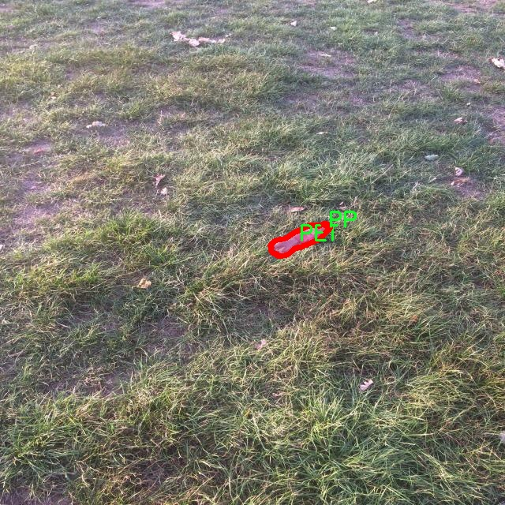

# 废弃物分类分割系统源码＆数据集分享
 [yolov8-seg-C2f-DCNV2-Dynamic＆yolov8-seg-C2f-DWR等50+全套改进创新点发刊_一键训练教程_Web前端展示]

### 1.研究背景与意义

项目参考[ILSVRC ImageNet Large Scale Visual Recognition Challenge](https://gitee.com/YOLOv8_YOLOv11_Segmentation_Studio/projects)

项目来源[AAAI Global Al lnnovation Contest](https://kdocs.cn/l/cszuIiCKVNis)

研究背景与意义

随着全球经济的快速发展和城市化进程的加速，废弃物管理问题日益凸显，成为各国政府和社会各界关注的焦点。废弃物的无序堆放和处理不仅造成了环境污染，还对生态系统和人类健康构成了严重威胁。因此，建立高效的废弃物分类与回收系统，促进资源的循环利用，已成为实现可持续发展的重要环节。在这一背景下，基于深度学习的图像处理技术，尤其是目标检测与分割技术，逐渐成为废弃物分类的重要工具。

YOLO（You Only Look Once）系列模型因其高效的实时检测能力而受到广泛关注。YOLOv8作为该系列的最新版本，结合了更先进的网络结构和优化算法，具有更高的检测精度和更快的处理速度。然而，针对废弃物分类的具体应用，YOLOv8仍存在一定的局限性，尤其是在复杂环境下的实例分割能力。因此，改进YOLOv8以提升其在废弃物分类与分割任务中的表现，具有重要的研究价值和实际意义。

本研究基于一个包含1500张图像和5个类别（HDPE、LDPE、PET、PP、PS）的废弃物实例分割数据集，旨在通过改进YOLOv8模型，构建一个高效的废弃物分类分割系统。该数据集的多样性和丰富性为模型的训练和验证提供了良好的基础，使得研究能够涵盖不同类型的废弃物，从而提高分类的准确性和鲁棒性。HDPE、LDPE、PET、PP和PS等塑料材料在日常生活中广泛存在，其分类和回收对于减少环境污染、节约资源具有重要意义。

在技术层面，本研究将探索多种改进策略，包括但不限于网络结构的优化、数据增强技术的应用以及损失函数的改进等，以提升YOLOv8在废弃物实例分割任务中的性能。通过引入更复杂的特征提取模块和改进的训练策略，期望能够提高模型对不同类别废弃物的识别能力，尤其是在复杂背景和遮挡情况下的表现。

从社会意义上看，研究成果将为废弃物管理提供一种新的技术手段，推动智能化垃圾分类的实施。通过实现高效的废弃物分类与分割，能够显著提高废弃物回收率，降低资源浪费，为实现绿色经济和可持续发展目标贡献力量。此外，该系统的推广应用还将促进公众对废弃物分类的认知与参与，提升社会整体的环保意识。

综上所述，基于改进YOLOv8的废弃物分类分割系统的研究，不仅具有重要的学术价值，还将为实际废弃物管理提供有效的解决方案，推动环境保护与资源循环利用的进程，具有深远的社会意义和应用前景。

### 2.图片演示


##### 注意：由于此博客编辑较早，上面“2.图片演示”和“3.视频演示”展示的系统图片或者视频可能为老版本，新版本在老版本的基础上升级如下：（实际效果以升级的新版本为准）

  （1）适配了YOLOV8的“目标检测”模型和“实例分割”模型，通过加载相应的权重（.pt）文件即可自适应加载模型。

  （2）支持“图片识别”、“视频识别”、“摄像头实时识别”三种识别模式。

  （3）支持“图片识别”、“视频识别”、“摄像头实时识别”三种识别结果保存导出，解决手动导出（容易卡顿出现爆内存）存在的问题，识别完自动保存结果并导出到tempDir中。

  （4）支持Web前端系统中的标题、背景图等自定义修改，后面提供修改教程。

  另外本项目提供训练的数据集和训练教程,暂不提供权重文件（best.pt）,需要您按照教程进行训练后实现图片演示和Web前端界面演示的效果。

### 3.视频演示

[3.1 视频演示](https://www.bilibili.com/video/BV1SASCYeEpD/)

### 4.数据集信息展示

##### 4.1 本项目数据集详细数据（类别数＆类别名）

nc: 5
names: ['HDPE', 'LDPE', 'PET', 'PP', 'PS']


##### 4.2 本项目数据集信息介绍

数据集信息展示

在现代环境保护和资源管理的背景下，废弃物分类与分割技术的研究显得尤为重要。为此，我们构建了一个名为“waste_instance_segmentation”的数据集，旨在为改进YOLOv8-seg模型提供高质量的训练数据。该数据集专注于五种主要的塑料废弃物类型，具体包括高密度聚乙烯（HDPE）、低密度聚乙烯（LDPE）、聚对苯二甲酸乙二醇酯（PET）、聚丙烯（PP）和聚苯乙烯（PS）。这些材料在日常生活中广泛存在，且其回收和再利用对减少环境污染、提高资源利用率具有重要意义。

数据集的构建过程经过精心设计，确保每种类别的样本数量和质量都能够满足深度学习模型的训练需求。我们在不同的环境和条件下收集了大量的废弃物图像，涵盖了各种拍摄角度、光照条件和背景环境。这种多样性不仅提高了模型的泛化能力，还使其能够更好地适应实际应用场景中的复杂性。每张图像都经过严格的标注，确保每个废弃物实例都被准确地分割和分类，为后续的模型训练提供了可靠的基础。

在数据集的标注过程中，我们采用了先进的图像分割技术，确保每个废弃物实例的边界清晰可辨。这种精细的标注方式使得模型能够学习到不同塑料材料的特征，从而在实际应用中实现更高的分类和分割精度。此外，为了增强模型的鲁棒性，我们还进行了数据增强处理，包括旋转、缩放、裁剪和颜色变换等操作。这些处理不仅丰富了数据集的多样性，还有效地防止了模型的过拟合现象。

“waste_instance_segmentation”数据集的设计理念不仅关注于数据的数量，更注重数据的质量和实用性。我们深知，优秀的模型离不开高质量的数据支持，因此在数据集的构建过程中，我们严格遵循数据采集和标注的标准，确保每个样本都能为模型的学习提供有价值的信息。通过对数据集的精心设计与优化，我们期望能够推动废弃物分类与分割技术的发展，为环境保护和可持续发展贡献一份力量。

随着深度学习技术的不断进步，基于“waste_instance_segmentation”数据集训练的YOLOv8-seg模型有望在废弃物分类与分割任务中取得显著的性能提升。我们相信，这一数据集不仅能够为学术研究提供重要的实验基础，也能为实际应用中的废弃物管理提供切实可行的解决方案。通过对废弃物的有效分类与分割，我们希望能够促进资源的循环利用，减少环境污染，推动社会的可持续发展。





### 5.全套项目环境部署视频教程（零基础手把手教学）

[5.1 环境部署教程链接（零基础手把手教学）](https://www.bilibili.com/video/BV1jG4Ve4E9t/?vd_source=bc9aec86d164b67a7004b996143742dc)


[5.2 安装Python虚拟环境创建和依赖库安装视频教程链接（零基础手把手教学）](https://www.bilibili.com/video/BV1nA4VeYEze/?vd_source=bc9aec86d164b67a7004b996143742dc)

### 6.手把手YOLOV8-seg训练视频教程（零基础小白有手就能学会）

[6.1 手把手YOLOV8-seg训练视频教程（零基础小白有手就能学会）](https://www.bilibili.com/video/BV1cA4VeYETe/?vd_source=bc9aec86d164b67a7004b996143742dc)


按照上面的训练视频教程链接加载项目提供的数据集，运行train.py即可开始训练



     Epoch   gpu_mem       box       obj       cls    labels  img_size
     1/200     0G   0.01576   0.01955  0.007536        22      1280: 100%|██████████| 849/849 [14:42<00:00,  1.04s/it]
               Class     Images     Labels          P          R     mAP@.5 mAP@.5:.95: 100%|██████████| 213/213 [01:14<00:00,  2.87it/s]
                 all       3395      17314      0.994      0.957      0.0957      0.0843

     Epoch   gpu_mem       box       obj       cls    labels  img_size
     2/200     0G   0.01578   0.01923  0.007006        22      1280: 100%|██████████| 849/849 [14:44<00:00,  1.04s/it]
               Class     Images     Labels          P          R     mAP@.5 mAP@.5:.95: 100%|██████████| 213/213 [01:12<00:00,  2.95it/s]
                 all       3395      17314      0.996      0.956      0.0957      0.0845

     Epoch   gpu_mem       box       obj       cls    labels  img_size
     3/200     0G   0.01561    0.0191  0.006895        27      1280: 100%|██████████| 849/849 [10:56<00:00,  1.29it/s]
               Class     Images     Labels          P          R     mAP@.5 mAP@.5:.95: 100%|███████   | 187/213 [00:52<00:00,  4.04it/s]
                 all       3395      17314      0.996      0.957      0.0957      0.0845


### 7.50+种全套YOLOV8-seg创新点代码加载调参视频教程（一键加载写好的改进模型的配置文件）

[7.1 50+种全套YOLOV8-seg创新点代码加载调参视频教程（一键加载写好的改进模型的配置文件）](https://www.bilibili.com/video/BV1Hw4VePEXv/?vd_source=bc9aec86d164b67a7004b996143742dc)

### 8.YOLOV8-seg图像分割算法原理

原始YOLOV8-seg算法原理

YOLOV8-seg算法是YOLO系列的最新进展，旨在将目标检测与语义分割相结合，以实现更高效、更准确的图像理解。该算法由Ultralytics公司于2023年发布，代表了计算机视觉领域中的一项重要创新。YOLOV8-seg不仅继承了YOLO系列的优良传统，还在结构设计和功能实现上进行了多方面的优化，尤其是在轻量化和高效性方面的突破，使其在各种应用场景中展现出强大的能力。

YOLOV8-seg的网络结构主要由四个部分组成：输入层、主干网络（Backbone）、颈部网络（Neck）和检测头（Head）。输入层负责对输入图像进行预处理，包括调整图像比例、进行Mosaic增强以及计算锚点。这一过程确保了输入数据的多样性和丰富性，为后续的特征提取奠定了基础。

在主干网络方面，YOLOV8-seg采用了CSP（Cross Stage Partial）结构，这一设计使得特征提取过程更加高效。CSP结构将特征提取分为两部分，分别进行卷积和连接，从而提高了特征流动的效率和模型的表达能力。YOLOV8-seg中的C2f模块替代了YOLOv5中的C3模块，通过调整卷积的深度和核大小，进一步增强了特征提取的能力。这种模块化的设计不仅提升了模型的性能，还保持了其轻量化的特性，使得YOLOV8-seg能够在资源受限的环境中依然表现出色。

在颈部网络的设计上，YOLOV8-seg采用了PAN-FPN（Path Aggregation Network - Feature Pyramid Network）结构。这一结构的核心在于特征的多尺度融合，通过有效地结合不同层次的特征信息，YOLOV8-seg能够更好地捕捉到目标的语义信息和空间信息。这种双塔结构的设计促进了语义特征与定位特征之间的转移，使得模型在处理复杂场景时，能够更准确地识别和分割目标。

YOLOV8-seg在检测头的设计上也进行了创新，采用了解耦头结构。这一结构将回归分支和预测分支分离，使得模型在进行目标检测时能够更快地收敛，提高了检测的速度和精度。与传统的锚框检测方法不同，YOLOV8-seg采用了Anchor-Free的检测方式，这一方法简化了检测过程，减少了模型的复杂性，使得YOLOV8-seg在处理不同尺度的目标时，能够展现出更强的适应性。

在损失函数的设计上，YOLOV8-seg使用了CloU损失函数，这一损失函数的引入使得模型在训练过程中能够更好地平衡定位精度和分类精度，从而提升了整体的检测性能。通过对损失函数的优化，YOLOV8-seg在面对复杂背景和遮挡物时，依然能够保持较高的检测准确率。

值得一提的是，YOLOV8-seg在轻量化方面的努力使得其在实际应用中具有更广泛的适用性。通过引入BiFPN（Bidirectional Feature Pyramid Network）网络，YOLOV8-seg能够高效地进行双向跨尺度连接和加权特征融合。这一设计不仅提高了模型对不同尺度特征信息的提取速度，还增强了模型在多样化场景下的表现能力，使得YOLOV8-seg在实时检测和分割任务中都能够游刃有余。

总的来说，YOLOV8-seg算法通过一系列创新的设计和优化，成功地将目标检测与语义分割结合在一起，形成了一种高效、准确且轻量化的解决方案。其在结构上的灵活性和功能上的强大，使得YOLOV8-seg在计算机视觉领域中具有广泛的应用前景，无论是在自动驾驶、安防监控，还是在医疗影像分析等领域，都展现出了其独特的价值和潜力。随着YOLOV8-seg的不断发展和完善，未来的计算机视觉任务将能够更加智能和高效地完成，推动这一领域的进一步进步。


### 9.系统功能展示（检测对象为举例，实际内容以本项目数据集为准）

图9.1.系统支持检测结果表格显示

  图9.2.系统支持置信度和IOU阈值手动调节

  图9.3.系统支持自定义加载权重文件best.pt(需要你通过步骤5中训练获得)

  图9.4.系统支持摄像头实时识别

  图9.5.系统支持图片识别

  图9.6.系统支持视频识别

  图9.7.系统支持识别结果文件自动保存

  图9.8.系统支持Excel导出检测结果数据


### 10.50+种全套YOLOV8-seg创新点原理讲解（非科班也可以轻松写刊发刊，V11版本正在科研待更新）

#### 10.1 由于篇幅限制，每个创新点的具体原理讲解就不一一展开，具体见下列网址中的创新点对应子项目的技术原理博客网址【Blog】：


[10.1 50+种全套YOLOV8-seg创新点原理讲解链接](https://gitee.com/qunmasj/good)

#### 10.2 部分改进模块原理讲解(完整的改进原理见上图和技术博客链接)【如果此小节的图加载失败可以通过CSDN或者Github搜索该博客的标题访问原始博客，原始博客图片显示正常】

### Gold-YOLO


#### Preliminaries
YOLO系列的中间层结构采用了传统的FPN结构，其中包含多个分支用于多尺度特征融合。然而，它只充分融合来自相邻级别的特征，对于其他层次的信息只能间接地进行“递归”获取。

传统的FPN结构在信息传输过程中存在丢失大量信息的问题。这是因为层之间的信息交互仅限于中间层选择的信息，未被选择的信息在传输过程中被丢弃。这种情况导致某个Level的信息只能充分辅助相邻层，而对其他全局层的帮助较弱。因此，整体上信息融合的有效性可能受到限制。
为了避免在传输过程中丢失信息，本文采用了一种新颖的“聚集和分发”机制（GD），放弃了原始的递归方法。该机制使用一个统一的模块来收集和融合所有Level的信息，并将其分发到不同的Level。通过这种方式，作者不仅避免了传统FPN结构固有的信息丢失问题，还增强了中间层的部分信息融合能力，而且并没有显著增加延迟。


#### 低阶聚合和分发分支 Low-stage gather-and-distribute branch
从主干网络中选择输出的B2、B3、B4、B5特征进行融合，以获取保留小目标信息的高分辨率特征。


#### 高阶聚合和分发分支 High-stage gather-and-distribute branch
高级全局特征对齐模块（High-GD）将由低级全局特征对齐模块（Low-GD）生成的特征{P3, P4, P5}进行融合。


Transformer融合模块由多个堆叠的transformer组成，transformer块的数量为L。每个transformer块包括一个多头注意力块、一个前馈网络（FFN）和残差连接。采用与LeViT相同的设置来配置多头注意力块，使用16个通道作为键K和查询Q的头维度，32个通道作为值V的头维度。为了加速推理过程，将层归一化操作替换为批归一化，并将所有的GELU激活函数替换为ReLU。为了增强变换器块的局部连接，在两个1x1卷积层之间添加了一个深度卷积层。同时，将FFN的扩展因子设置为2，以在速度和计算成本之间取得平衡。


信息注入模块(Information injection module)： 高级全局特征对齐模块（High-GD）中的信息注入模块与低级全局特征对齐模块（Low-GD）中的相同。在高级阶段，局部特征（Flocal）等于Pi，因此公式如下所示：


#### 增强的跨层信息流动 Enhanced cross-layer information flow
为了进一步提升性能，从YOLOv6 中的PAFPN模块中得到启发，引入了Inject-LAF模块。该模块是注入模块的增强版，包括了一个轻量级相邻层融合（LAF）模块，该模块被添加到注入模块的输入位置。为了在速度和准确性之间取得平衡，设计了两个LAF模型：LAF低级模型和LAF高级模型，分别用于低级注入（合并相邻两层的特征）和高级注入（合并相邻一层的特征）。它们的结构如图5(b)所示。为了确保来自不同层级的特征图与目标大小对齐，在实现中的两个LAF模型仅使用了三个操作符：双线性插值（上采样过小的特征）、平均池化（下采样过大的特征）和1x1卷积（调整与目标通道不同的特征）。模型中的LAF模块与信息注入模块的结合有效地平衡了准确性和速度之间的关系。通过使用简化的操作，能够增加不同层级之间的信息流路径数量，从而提高性能而不显著增加延迟。


### 11.项目核心源码讲解（再也不用担心看不懂代码逻辑）

#### 11.1 ultralytics\nn\modules\head.py

以下是对给定代码的核心部分进行分析和详细注释的结果。我们将重点保留YOLOv8模型的检测头（Detect类）及其相关部分，因为它是整个模型的核心。

```python
import torch
import torch.nn as nn
from .conv import Conv
from .utils import bias_init_with_prob

class Detect(nn.Module):
    """YOLOv8检测头，用于目标检测模型。"""
    
    def __init__(self, nc=80, ch=()):
        """初始化YOLOv8检测层，指定类别数和通道数。
        
        参数:
        nc (int): 类别数，默认为80。
        ch (tuple): 输入通道数的元组。
        """
        super().__init__()
        self.nc = nc  # 类别数
        self.nl = len(ch)  # 检测层的数量
        self.reg_max = 16  # DFL通道数
        self.no = nc + self.reg_max * 4  # 每个锚点的输出数量
        self.stride = torch.zeros(self.nl)  # 在构建时计算的步幅
        
        # 定义卷积层
        c2, c3 = max((16, ch[0] // 4, self.reg_max * 4)), max(ch[0], min(self.nc, 100))  # 通道数
        self.cv2 = nn.ModuleList(
            nn.Sequential(Conv(x, c2, 3), Conv(c2, c2, 3), nn.Conv2d(c2, 4 * self.reg_max, 1)) for x in ch)
        self.cv3 = nn.ModuleList(nn.Sequential(Conv(x, c3, 3), Conv(c3, c3, 3), nn.Conv2d(c3, self.nc, 1)) for x in ch)
        self.dfl = DFL(self.reg_max) if self.reg_max > 1 else nn.Identity()  # DFL层

    def forward(self, x):
        """连接并返回预测的边界框和类别概率。
        
        参数:
        x (list): 输入特征图列表。
        
        返回:
        y (tensor): 输出的边界框和类别概率。
        """
        shape = x[0].shape  # BCHW格式
        for i in range(self.nl):
            # 对每个检测层进行卷积操作并连接结果
            x[i] = torch.cat((self.cv2[i](x[i]), self.cv3[i](x[i])), 1)
        
        # 如果在训练中，直接返回特征图
        if self.training:
            return x
        
        # 动态锚点生成
        self.anchors, self.strides = (x.transpose(0, 1) for x in make_anchors(x, self.stride, 0.5))
        self.shape = shape

        # 将特征图展平并连接
        x_cat = torch.cat([xi.view(shape[0], self.no, -1) for xi in x], 2)
        box, cls = x_cat.split((self.reg_max * 4, self.nc), 1)  # 分割边界框和类别

        # 计算最终的边界框
        dbox = dist2bbox(self.dfl(box), self.anchors.unsqueeze(0), xywh=True, dim=1) * self.strides

        # 连接边界框和类别概率
        y = torch.cat((dbox, cls.sigmoid()), 1)
        return y if self.export else (y, x)

    def bias_init(self):
        """初始化Detect()的偏置，警告：需要步幅可用。"""
        m = self  # self.model[-1]  # Detect()模块
        for a, b, s in zip(m.cv2, m.cv3, m.stride):  # 从
            a[-1].bias.data[:] = 1.0  # 边界框偏置
            b[-1].bias.data[:m.nc] = math.log(5 / m.nc / (640 / s) ** 2)  # 类别偏置

# 以上是YOLOv8检测头的核心部分，包含了模型的初始化、前向传播和偏置初始化的功能。
```

### 代码分析
1. **Detect类**：这是YOLOv8的检测头，负责生成目标检测的边界框和类别概率。
2. **初始化方法**：在初始化中，定义了输入通道、类别数、输出数量等，并创建了多个卷积层用于特征提取。
3. **前向传播方法**：在前向传播中，首先对输入特征图进行卷积操作，然后根据是否在训练模式下处理锚点和输出结果。
4. **偏置初始化**：提供了一个方法来初始化卷积层的偏置，以提高模型的收敛速度。

以上是对YOLOv8检测头的核心部分的详细分析和注释，涵盖了模型的主要功能和结构。

该文件是Ultralytics YOLOv8模型的头部模块，主要包含了多个检测、分割、姿态估计和分类的模型头部类。文件的结构和功能如下：

首先，文件导入了必要的库，包括PyTorch和一些自定义的模块。接着，定义了几个类，分别用于不同的任务。

`Detect`类是YOLOv8检测模型的核心，负责生成检测结果。它的构造函数接收类别数量和通道数作为参数，并初始化了一些重要的参数，如输出的数量、锚框、步幅等。在前向传播中，`Detect`类将输入特征图经过一系列卷积层处理，生成边界框和类别概率。如果处于训练模式，直接返回处理后的特征；如果处于推理模式，则会根据输入的形状动态生成锚框，并计算最终的边界框和类别概率。

`Segment`类继承自`Detect`，用于分割任务。它在构造函数中增加了掩膜数量和原型数量的参数，并初始化了相应的卷积层。在前向传播中，除了调用父类的前向传播外，还会生成掩膜系数，并在训练时返回掩膜系数和原型。

`Pose`类同样继承自`Detect`，用于姿态估计任务。它的构造函数中定义了关键点的形状，并初始化了相应的卷积层。在前向传播中，生成关键点的预测，并在训练时返回检测结果和关键点信息。

`Classify`类用于分类任务，接收输入通道和输出通道等参数，构建了卷积层、池化层和全连接层。在前向传播中，它将输入特征经过处理后输出分类结果。

最后，`RTDETRDecoder`类实现了实时可变形Transformer解码器，用于物体检测。它包含了输入投影、Transformer模块、去噪部分和解码头等多个组件。在前向传播中，它将输入特征经过解码器处理，返回边界框和分类分数。

整体来看，这个文件定义了YOLOv8模型的多个重要组件，支持不同的任务，如检测、分割、姿态估计和分类。每个类都有其特定的功能和前向传播逻辑，通过组合这些模块，可以实现复杂的计算机视觉任务。

#### 11.2 ultralytics\trackers\utils\gmc.py

以下是代码中最核心的部分，并附上详细的中文注释：

```python
import cv2
import numpy as np

class GMC:
    """
    通用运动补偿 (GMC) 类，用于视频帧中的跟踪和物体检测。
    该类提供了基于多种跟踪算法（包括 ORB、SIFT、ECC 和稀疏光流）的物体跟踪和检测方法。
    """

    def __init__(self, method='sparseOptFlow', downscale=2):
        """初始化 GMC 对象，指定跟踪方法和缩放因子。"""
        self.method = method  # 跟踪方法
        self.downscale = max(1, int(downscale))  # 确保缩放因子至少为 1

        # 根据选择的跟踪方法初始化相应的检测器和匹配器
        if self.method == 'orb':
            self.detector = cv2.FastFeatureDetector_create(20)
            self.extractor = cv2.ORB_create()
            self.matcher = cv2.BFMatcher(cv2.NORM_HAMMING)
        elif self.method == 'sift':
            self.detector = cv2.SIFT_create()
            self.extractor = cv2.SIFT_create()
            self.matcher = cv2.BFMatcher(cv2.NORM_L2)
        elif self.method == 'ecc':
            self.warp_mode = cv2.MOTION_EUCLIDEAN
            self.criteria = (cv2.TERM_CRITERIA_EPS | cv2.TERM_CRITERIA_COUNT, 5000, 1e-6)
        elif self.method == 'sparseOptFlow':
            self.feature_params = dict(maxCorners=1000, qualityLevel=0.01, minDistance=1, blockSize=3)
        elif self.method in ['none', 'None', None]:
            self.method = None
        else:
            raise ValueError(f'错误: 未知的 GMC 方法: {method}')

        # 初始化状态变量
        self.prevFrame = None  # 存储上一帧
        self.prevKeyPoints = None  # 存储上一帧的关键点
        self.prevDescriptors = None  # 存储上一帧的描述符
        self.initializedFirstFrame = False  # 标记是否已处理第一帧

    def apply(self, raw_frame, detections=None):
        """根据指定的方法在原始帧上应用物体检测。"""
        if self.method in ['orb', 'sift']:
            return self.applyFeatures(raw_frame, detections)  # 应用特征检测
        elif self.method == 'ecc':
            return self.applyEcc(raw_frame, detections)  # 应用 ECC 算法
        elif self.method == 'sparseOptFlow':
            return self.applySparseOptFlow(raw_frame, detections)  # 应用稀疏光流法
        else:
            return np.eye(2, 3)  # 返回单位矩阵

    def applyEcc(self, raw_frame, detections=None):
        """应用 ECC 算法进行运动补偿。"""
        height, width, _ = raw_frame.shape  # 获取帧的高度和宽度
        frame = cv2.cvtColor(raw_frame, cv2.COLOR_BGR2GRAY)  # 将帧转换为灰度图
        H = np.eye(2, 3, dtype=np.float32)  # 初始化变换矩阵为单位矩阵

        # 根据缩放因子缩小图像
        if self.downscale > 1.0:
            frame = cv2.resize(frame, (width // self.downscale, height // self.downscale))

        # 处理第一帧
        if not self.initializedFirstFrame:
            self.prevFrame = frame.copy()  # 保存当前帧为上一帧
            self.initializedFirstFrame = True  # 标记已初始化第一帧
            return H

        # 运行 ECC 算法，结果存储在 H 中
        try:
            (cc, H) = cv2.findTransformECC(self.prevFrame, frame, H, self.warp_mode, self.criteria)
        except Exception as e:
            LOGGER.warning(f'警告: 找到变换失败，设置变换为单位矩阵 {e}')

        return H

    def applyFeatures(self, raw_frame, detections=None):
        """应用特征检测方法（如 ORB 或 SIFT）。"""
        height, width, _ = raw_frame.shape
        frame = cv2.cvtColor(raw_frame, cv2.COLOR_BGR2GRAY)
        H = np.eye(2, 3)

        # 缩小图像
        if self.downscale > 1.0:
            frame = cv2.resize(frame, (width // self.downscale, height // self.downscale))

        # 检测关键点
        keypoints = self.detector.detect(frame)

        # 处理第一帧
        if not self.initializedFirstFrame:
            self.prevFrame = frame.copy()
            self.prevKeyPoints = copy.copy(keypoints)
            self.initializedFirstFrame = True
            return H

        # 匹配描述符
        knnMatches = self.matcher.knnMatch(self.prevDescriptors, descriptors, 2)

        # 过滤匹配
        matches = []
        for m, n in knnMatches:
            if m.distance < 0.9 * n.distance:
                matches.append(m)

        # 找到刚性变换矩阵
        if len(matches) > 4:
            prevPoints = np.array([self.prevKeyPoints[m.queryIdx].pt for m in matches])
            currPoints = np.array([keypoints[m.trainIdx].pt for m in matches])
            H, inliers = cv2.estimateAffinePartial2D(prevPoints, currPoints, cv2.RANSAC)

        # 保存当前帧和关键点以备下次使用
        self.prevFrame = frame.copy()
        self.prevKeyPoints = copy.copy(keypoints)

        return H

    def applySparseOptFlow(self, raw_frame, detections=None):
        """应用稀疏光流法进行运动补偿。"""
        height, width, _ = raw_frame.shape
        frame = cv2.cvtColor(raw_frame, cv2.COLOR_BGR2GRAY)
        H = np.eye(2, 3)

        # 缩小图像
        if self.downscale > 1.0:
            frame = cv2.resize(frame, (width // self.downscale, height // self.downscale))

        # 找到关键点
        keypoints = cv2.goodFeaturesToTrack(frame, mask=None, **self.feature_params)

        # 处理第一帧
        if not self.initializedFirstFrame:
            self.prevFrame = frame.copy()
            self.prevKeyPoints = copy.copy(keypoints)
            self.initializedFirstFrame = True
            return H

        # 计算光流
        matchedKeypoints, status, err = cv2.calcOpticalFlowPyrLK(self.prevFrame, frame, self.prevKeyPoints, None)

        # 留下好的匹配点
        prevPoints = []
        currPoints = []
        for i in range(len(status)):
            if status[i]:
                prevPoints.append(self.prevKeyPoints[i])
                currPoints.append(matchedKeypoints[i])

        # 找到刚性变换矩阵
        if len(prevPoints) > 4:
            H, inliers = cv2.estimateAffinePartial2D(np.array(prevPoints), np.array(currPoints), cv2.RANSAC)

        # 保存当前帧和关键点以备下次使用
        self.prevFrame = frame.copy()
        self.prevKeyPoints = copy.copy(keypoints)

        return H
```

### 代码核心部分说明：
1. **类初始化**：在 `__init__` 方法中，根据用户指定的跟踪方法初始化相应的检测器和匹配器，同时设置一些状态变量。
2. **应用方法**：`apply` 方法根据选择的跟踪方法调用相应的处理函数（如 `applyFeatures`、`applyEcc`、`applySparseOptFlow`）。
3. **ECC 方法**：`applyEcc` 方法实现了基于增强互相关 (ECC) 的运动补偿，处理第一帧并计算变换矩阵。
4. **特征方法**：`applyFeatures` 方法使用特征检测（如 ORB 或 SIFT）来跟踪物体，处理第一帧并计算描述符匹配。
5. **稀疏光流方法**：`applySparseOptFlow` 方法使用稀疏光流法来跟踪物体，处理第一帧并计算光流。

以上代码为运动补偿和物体跟踪提供了基础功能，能够根据不同的算法进行处理。

这个程序文件定义了一个名为 `GMC` 的类，主要用于视频帧中的跟踪和物体检测。该类实现了多种跟踪算法，包括 ORB、SIFT、ECC 和稀疏光流，能够根据需要对帧进行下采样以提高计算效率。

在 `GMC` 类的构造函数中，用户可以指定所用的跟踪方法和下采样因子。根据所选的方法，程序会初始化相应的特征检测器、描述符提取器和匹配器。例如，如果选择 ORB 方法，程序会创建一个 ORB 特征提取器和一个基于汉明距离的暴力匹配器；如果选择 SIFT 方法，则会使用 SIFT 特征提取器和基于欧几里得距离的匹配器；而对于 ECC 方法，程序会设置一些迭代参数和终止条件。

类中有多个方法，其中 `apply` 方法根据当前选择的跟踪方法调用相应的处理函数。具体来说，`applyEcc` 方法实现了基于 ECC 的图像配准，`applyFeatures` 方法则实现了基于特征的跟踪，而 `applySparseOptFlow` 方法则使用稀疏光流进行跟踪。

在 `applyEcc` 方法中，首先将输入帧转换为灰度图像，并进行下采样处理。对于第一帧，程序会初始化先前帧的存储变量；而在后续帧中，程序会使用 `cv2.findTransformECC` 函数计算当前帧与先前帧之间的变换矩阵。

`applyFeatures` 方法同样会对输入帧进行处理，首先将其转换为灰度图像并下采样。然后，程序会使用特征检测器检测关键点，并计算其描述符。接着，程序会通过匹配描述符来找到对应的关键点，并使用 RANSAC 算法估计出刚性变换矩阵。

`applySparseOptFlow` 方法则使用稀疏光流法来跟踪关键点。该方法首先检测关键点，然后计算这些关键点在当前帧中的对应位置，并使用 RANSAC 估计变换矩阵。

整个类的设计旨在提供灵活的跟踪功能，能够根据不同的需求选择合适的算法，并通过下采样提高处理效率。每个方法都包含对输入帧的处理、特征的提取与匹配，以及变换矩阵的计算，确保能够有效地跟踪视频中的物体。

#### 11.3 ultralytics\models\fastsam\model.py

以下是代码中最核心的部分，并附上详细的中文注释：

```python
# 引入必要的库
from pathlib import Path
from ultralytics.engine.model import Model
from .predict import FastSAMPredictor
from .val import FastSAMValidator

class FastSAM(Model):
    """
    FastSAM模型接口。

    示例用法：
        ```python
        from ultralytics import FastSAM

        model = FastSAM('last.pt')  # 加载模型
        results = model.predict('ultralytics/assets/bus.jpg')  # 进行预测
        ```
    """

    def __init__(self, model='FastSAM-x.pt'):
        """初始化FastSAM类，调用父类（YOLO）的__init__方法，并设置默认模型。"""
        # 如果传入的模型名是'FastSAM.pt'，则替换为'FastSAM-x.pt'
        if str(model) == 'FastSAM.pt':
            model = 'FastSAM-x.pt'
        
        # 确保模型文件的后缀不是.yaml或.yml，FastSAM模型只支持预训练模型
        assert Path(model).suffix not in ('.yaml', '.yml'), 'FastSAM models only support pre-trained models.'
        
        # 调用父类的初始化方法，设置模型和任务类型为'segment'
        super().__init__(model=model, task='segment')

    @property
    def task_map(self):
        """返回一个字典，将分割任务映射到相应的预测器和验证器类。"""
        return {'segment': {'predictor': FastSAMPredictor, 'validator': FastSAMValidator}}
```

### 代码注释说明：
1. **引入库**：导入必要的模块和类，`Path`用于处理文件路径，`Model`是YOLO模型的基类，`FastSAMPredictor`和`FastSAMValidator`是用于预测和验证的类。
  
2. **FastSAM类**：定义了一个名为`FastSAM`的类，继承自`Model`，用于实现FastSAM模型的接口。

3. **构造函数**：`__init__`方法用于初始化`FastSAM`对象。它检查模型名称并确保只使用预训练模型。

4. **任务映射**：`task_map`属性返回一个字典，映射分割任务到相应的预测器和验证器类，便于后续的模型预测和验证操作。

这个程序文件定义了一个名为 `FastSAM` 的类，继承自 `Model` 类，主要用于实现 FastSAM 模型的接口。文件的开头部分包含了一些版权信息，表明该代码遵循 AGPL-3.0 许可证。

在 `FastSAM` 类的文档字符串中，提供了一个简单的使用示例，展示了如何导入 `FastSAM` 类并实例化一个模型对象，然后使用该模型对一张图片进行预测。这个示例表明，用户可以通过传入模型文件的路径来创建模型实例，并调用 `predict` 方法进行图像处理。

类的构造函数 `__init__` 接受一个参数 `model`，默认值为 `'FastSAM-x.pt'`。在构造函数中，如果传入的模型名称是 `'FastSAM.pt'`，则将其替换为 `'FastSAM-x.pt'`。接着，使用 `assert` 语句确保传入的模型文件后缀不是 `.yaml` 或 `.yml`，因为 FastSAM 模型只支持预训练模型。最后，调用父类 `Model` 的构造函数，传入模型路径和任务类型（这里是 `'segment'`）。

`task_map` 属性返回一个字典，映射了任务类型（此处为 `'segment'`）到相应的预测器和验证器类。这个映射关系允许模型在执行不同任务时能够调用相应的处理类，从而实现灵活的功能扩展。

总体来说，这个文件提供了 FastSAM 模型的基本结构和接口，方便用户进行图像分割任务的实现。

#### 11.4 ultralytics\nn\extra_modules\ops_dcnv3\setup.py

以下是经过简化和注释的核心代码部分：

```python
# 导入必要的库
import os
import glob
import torch
from torch.utils.cpp_extension import CUDA_HOME, CppExtension, CUDAExtension
from setuptools import find_packages, setup

# 定义所需的依赖包
requirements = ["torch", "torchvision"]

def get_extensions():
    # 获取当前文件目录
    this_dir = os.path.dirname(os.path.abspath(__file__))
    # 定义扩展模块的源代码目录
    extensions_dir = os.path.join(this_dir, "src")

    # 获取主文件和CPU、CUDA源文件
    main_file = glob.glob(os.path.join(extensions_dir, "*.cpp"))
    source_cpu = glob.glob(os.path.join(extensions_dir, "cpu", "*.cpp"))
    source_cuda = glob.glob(os.path.join(extensions_dir, "cuda", "*.cu"))

    # 合并源文件
    sources = main_file + source_cpu
    extension = CppExtension  # 默认使用 CppExtension
    extra_compile_args = {"cxx": []}  # 编译参数
    define_macros = []  # 宏定义

    # 检查CUDA是否可用
    if torch.cuda.is_available() and CUDA_HOME is not None:
        extension = CUDAExtension  # 使用 CUDAExtension
        sources += source_cuda  # 添加CUDA源文件
        define_macros += [("WITH_CUDA", None)]  # 定义宏
        extra_compile_args["nvcc"] = []  # CUDA编译参数
    else:
        raise NotImplementedError('Cuda is not available')  # 抛出异常

    # 生成完整的源文件路径
    sources = [os.path.join(extensions_dir, s) for s in sources]
    include_dirs = [extensions_dir]  # 包含目录

    # 创建扩展模块
    ext_modules = [
        extension(
            "DCNv3",  # 模块名称
            sources,  # 源文件
            include_dirs=include_dirs,  # 包含目录
            define_macros=define_macros,  # 宏定义
            extra_compile_args=extra_compile_args,  # 编译参数
        )
    ]
    return ext_modules  # 返回扩展模块列表

# 设置包信息和扩展模块
setup(
    name="DCNv3",  # 包名称
    version="1.1",  # 版本号
    author="InternImage",  # 作者
    url="https://github.com/OpenGVLab/InternImage",  # 项目网址
    description="PyTorch Wrapper for CUDA Functions of DCNv3",  # 描述
    packages=find_packages(exclude=("configs", "tests")),  # 查找包
    ext_modules=get_extensions(),  # 获取扩展模块
    cmdclass={"build_ext": torch.utils.cpp_extension.BuildExtension},  # 自定义构建命令
)
```

### 代码说明：
1. **导入库**：导入了处理文件路径、CUDA扩展和设置包的必要库。
2. **获取扩展函数**：`get_extensions` 函数负责查找源文件并根据CUDA的可用性选择合适的扩展类型（CPU或CUDA）。
3. **源文件收集**：通过 `glob` 模块收集主文件、CPU和CUDA源文件，并合并到 `sources` 列表中。
4. **CUDA检查**：检查CUDA是否可用，如果可用，则添加CUDA源文件和相应的宏定义。
5. **设置扩展模块**：使用 `setup` 函数设置包的名称、版本、作者、描述等信息，并调用 `get_extensions` 获取扩展模块。

这个 `setup.py` 文件是用于构建和安装一个名为 `DCNv3` 的 Python 包，该包是一个 PyTorch 的扩展，主要用于支持 DCNv3 的 CUDA 功能。文件的开头包含了一些版权信息和许可证声明，接着引入了必要的库和模块。

首先，文件导入了 `os` 和 `glob` 模块，这些模块用于处理文件和目录的操作。然后，导入了 `torch` 以及 PyTorch 的 C++ 扩展工具，具体包括 `CUDA_HOME`、`CppExtension` 和 `CUDAExtension`，这些都是用于编译 C++ 和 CUDA 代码的工具。

接下来，定义了一个 `requirements` 列表，列出了该包所依赖的 Python 库，包括 `torch` 和 `torchvision`。

`get_extensions` 函数是文件的核心部分，它负责查找和准备要编译的源文件。首先，它获取当前文件的目录，并构建源文件的路径。通过 `glob` 模块，函数查找 `src` 目录下的所有 C++ 源文件（`.cpp`）和 CUDA 源文件（`.cu`），并将它们分别存储在 `main_file`、`source_cpu` 和 `source_cuda` 列表中。

然后，函数将 CPU 源文件和主文件合并到 `sources` 列表中，并初始化扩展类型为 `CppExtension`。接着，定义了一些编译参数和宏。如果系统支持 CUDA，且 `CUDA_HOME` 不为空，则将扩展类型更改为 `CUDAExtension`，并将 CUDA 源文件添加到 `sources` 列表中，同时定义了一个宏 `WITH_CUDA`。如果 CUDA 不可用，则抛出一个 `NotImplementedError` 异常。

最后，函数将源文件的完整路径和包含目录传递给 `extension` 函数，构建出扩展模块的列表并返回。

在文件的最后，调用 `setup` 函数来配置包的元数据和构建信息，包括包的名称、版本、作者、项目网址、描述、需要排除的包（如 `configs` 和 `tests`），以及通过 `get_extensions` 函数获取的扩展模块。还指定了一个命令类 `cmdclass`，用于处理扩展的构建过程。

总的来说，这个 `setup.py` 文件的作用是为 `DCNv3` 包提供必要的构建和安装配置，确保能够正确编译和链接 C++ 和 CUDA 代码，从而使其能够在 PyTorch 中使用。

#### 11.5 ultralytics\models\nas\val.py

以下是代码中最核心的部分，并附上详细的中文注释：

```python
import torch
from ultralytics.utils import ops

class NASValidator:
    """
    Ultralytics YOLO NAS 验证器，用于目标检测。

    该类用于对 YOLO NAS 模型生成的原始预测结果进行后处理。它执行非最大抑制（NMS），以去除重叠和低置信度的框，最终生成最终检测结果。
    """

    def postprocess(self, preds_in):
        """对预测输出应用非最大抑制（NMS）。"""
        # 将预测结果的边界框从 xyxy 格式转换为 xywh 格式
        boxes = ops.xyxy2xywh(preds_in[0][0])
        
        # 将边界框和置信度合并，并调整维度
        preds = torch.cat((boxes, preds_in[0][1]), -1).permute(0, 2, 1)
        
        # 应用非最大抑制，去除重叠的框
        return ops.non_max_suppression(preds,
                                       self.args.conf,  # 置信度阈值
                                       self.args.iou,   # IoU 阈值
                                       labels=self.lb,  # 可选的多标签 NMS
                                       multi_label=False,  # 是否使用多标签
                                       agnostic=self.args.single_cls,  # 是否类别无关
                                       max_det=self.args.max_det,  # 最大检测框数量
                                       max_time_img=0.5)  # 每张图像的最大处理时间
```

### 代码说明：
1. **导入必要的库**：
   - `torch`：用于张量操作和深度学习模型。
   - `ops`：从 `ultralytics.utils` 导入的操作函数，包含用于处理预测结果的函数。

2. **NASValidator 类**：
   - 该类用于对 YOLO NAS 模型的输出进行后处理，主要功能是去除重叠的检测框。

3. **postprocess 方法**：
   - 输入参数 `preds_in`：包含模型的原始预测结果。
   - 使用 `ops.xyxy2xywh` 将边界框从 `(x1, y1, x2, y2)` 格式转换为 `(x_center, y_center, width, height)` 格式。
   - 使用 `torch.cat` 将边界框和置信度合并，并调整维度以便后续处理。
   - 调用 `ops.non_max_suppression` 执行非最大抑制，去除重叠和低置信度的框，返回最终的检测结果。 

### 注意事项：
- 该类通常不直接实例化，而是在 `NAS` 类内部使用。

这个程序文件定义了一个名为 `NASValidator` 的类，属于 Ultralytics YOLO NAS 模型的验证器，用于目标检测任务。该类继承自 `DetectionValidator`，其主要功能是对 YOLO NAS 模型生成的原始预测结果进行后处理。

在 `NASValidator` 类中，首先定义了一些属性和方法。该类的构造函数并未显式给出，但它会自动调用父类 `DetectionValidator` 的构造函数。类的文档字符串中详细说明了其用途，包括它如何执行非极大值抑制（NMS）来去除重叠和低置信度的框，从而生成最终的检测结果。

`args` 属性是一个命名空间，包含了后处理所需的各种配置参数，例如置信度阈值和交并比（IoU）阈值。`lb` 属性是一个可选的张量，用于多标签的非极大值抑制。

在类中定义了一个 `postprocess` 方法，该方法接收原始预测结果 `preds_in` 作为输入。首先，它通过调用 `ops.xyxy2xywh` 函数将预测框的坐标从 `(x1, y1, x2, y2)` 格式转换为 `(x_center, y_center, width, height)` 格式。接着，它将框和对应的置信度进行拼接，并调整维度顺序。最后，调用 `ops.non_max_suppression` 方法执行非极大值抑制，返回最终的检测结果。

示例代码展示了如何使用 `NASValidator`。首先从 `ultralytics` 导入 `NAS` 类，然后实例化一个 YOLO NAS 模型，并获取其验证器。假设已经有了原始预测结果 `raw_preds`，可以通过调用 `validator.postprocess(raw_preds)` 来获得最终的预测结果。

需要注意的是，这个类通常不会被直接实例化，而是在 `NAS` 类内部使用。这样设计使得模型的使用更加简洁，用户只需关注模型的调用和预测结果的获取。

### 12.系统整体结构（节选）

### 整体功能和构架概括

Ultralytics 是一个用于计算机视觉任务的深度学习框架，特别是在目标检测、分割和姿态估计等领域。该框架包含多个模块和工具，支持快速构建和训练深度学习模型。以下是对主要文件的功能和架构的概括：

1. **`head.py`**：定义了 YOLOv8 模型的头部模块，支持多种任务（检测、分割、姿态估计和分类），并实现了前向传播逻辑。
2. **`gmc.py`**：实现了一个通用的多目标跟踪器，支持多种跟踪算法（如 ORB、SIFT、ECC 和稀疏光流），用于视频帧中的物体跟踪。
3. **`model.py`**：提供了 FastSAM 模型的接口，允许用户加载和使用该模型进行图像分割任务。
4. **`setup.py`**：用于构建和安装 DCNv3 包，包含 C++ 和 CUDA 代码的编译配置，确保与 PyTorch 的兼容性。
5. **`val.py`**：定义了 NAS 模型的验证器，负责对模型的预测结果进行后处理，包括非极大值抑制，以生成最终的检测结果。

### 文件功能整理表

| 文件路径                                         | 功能描述                                                                                       |
|--------------------------------------------------|-----------------------------------------------------------------------------------------------|
| `ultralytics/nn/modules/head.py`                | 定义 YOLOv8 模型的头部模块，支持检测、分割、姿态估计和分类任务的前向传播逻辑。                     |
| `ultralytics/trackers/utils/gmc.py`             | 实现多目标跟踪器，支持 ORB、SIFT、ECC 和稀疏光流等多种跟踪算法，用于视频帧中的物体跟踪。           |
| `ultralytics/models/fastsam/model.py`           | 提供 FastSAM 模型的接口，允许用户加载和使用该模型进行图像分割任务。                             |
| `ultralytics/nn/extra_modules/ops_dcnv3/setup.py` | 构建和安装 DCNv3 包，配置 C++ 和 CUDA 代码的编译，确保与 PyTorch 的兼容性。                     |
| `ultralytics/models/nas/val.py`                  | 定义 NAS 模型的验证器，负责对模型的预测结果进行后处理，包括非极大值抑制以生成最终检测结果。       |

这个表格总结了每个文件的主要功能，帮助理解 Ultralytics 框架的整体结构和各个模块之间的关系。

注意：由于此博客编辑较早，上面“11.项目核心源码讲解（再也不用担心看不懂代码逻辑）”中部分代码可能会优化升级，仅供参考学习，完整“训练源码”、“Web前端界面”和“50+种创新点源码”以“14.完整训练+Web前端界面+50+种创新点源码、数据集获取”的内容为准。

### 13.图片、视频、摄像头图像分割Demo(去除WebUI)代码

在这个博客小节中，我们将讨论如何在不使用WebUI的情况下，实现图像分割模型的使用。本项目代码已经优化整合，方便用户将分割功能嵌入自己的项目中。
核心功能包括图片、视频、摄像头图像的分割，ROI区域的轮廓提取、类别分类、周长计算、面积计算、圆度计算以及颜色提取等。
这些功能提供了良好的二次开发基础。

### 核心代码解读

以下是主要代码片段，我们会为每一块代码进行详细的批注解释：

```python
import random
import cv2
import numpy as np
from PIL import ImageFont, ImageDraw, Image
from hashlib import md5
from model import Web_Detector
from chinese_name_list import Label_list

# 根据名称生成颜色
def generate_color_based_on_name(name):
    ......

# 计算多边形面积
def calculate_polygon_area(points):
    return cv2.contourArea(points.astype(np.float32))

...
# 绘制中文标签
def draw_with_chinese(image, text, position, font_size=20, color=(255, 0, 0)):
    image_pil = Image.fromarray(cv2.cvtColor(image, cv2.COLOR_BGR2RGB))
    draw = ImageDraw.Draw(image_pil)
    font = ImageFont.truetype("simsun.ttc", font_size, encoding="unic")
    draw.text(position, text, font=font, fill=color)
    return cv2.cvtColor(np.array(image_pil), cv2.COLOR_RGB2BGR)

# 动态调整参数
def adjust_parameter(image_size, base_size=1000):
    max_size = max(image_size)
    return max_size / base_size

# 绘制检测结果
def draw_detections(image, info, alpha=0.2):
    name, bbox, conf, cls_id, mask = info['class_name'], info['bbox'], info['score'], info['class_id'], info['mask']
    adjust_param = adjust_parameter(image.shape[:2])
    spacing = int(20 * adjust_param)

    if mask is None:
        x1, y1, x2, y2 = bbox
        aim_frame_area = (x2 - x1) * (y2 - y1)
        cv2.rectangle(image, (x1, y1), (x2, y2), color=(0, 0, 255), thickness=int(3 * adjust_param))
        image = draw_with_chinese(image, name, (x1, y1 - int(30 * adjust_param)), font_size=int(35 * adjust_param))
        y_offset = int(50 * adjust_param)  # 类别名称上方绘制，其下方留出空间
    else:
        mask_points = np.concatenate(mask)
        aim_frame_area = calculate_polygon_area(mask_points)
        mask_color = generate_color_based_on_name(name)
        try:
            overlay = image.copy()
            cv2.fillPoly(overlay, [mask_points.astype(np.int32)], mask_color)
            image = cv2.addWeighted(overlay, 0.3, image, 0.7, 0)
            cv2.drawContours(image, [mask_points.astype(np.int32)], -1, (0, 0, 255), thickness=int(8 * adjust_param))

            # 计算面积、周长、圆度
            area = cv2.contourArea(mask_points.astype(np.int32))
            perimeter = cv2.arcLength(mask_points.astype(np.int32), True)
            ......

            # 计算色彩
            mask = np.zeros(image.shape[:2], dtype=np.uint8)
            cv2.drawContours(mask, [mask_points.astype(np.int32)], -1, 255, -1)
            color_points = cv2.findNonZero(mask)
            ......

            # 绘制类别名称
            x, y = np.min(mask_points, axis=0).astype(int)
            image = draw_with_chinese(image, name, (x, y - int(30 * adjust_param)), font_size=int(35 * adjust_param))
            y_offset = int(50 * adjust_param)

            # 绘制面积、周长、圆度和色彩值
            metrics = [("Area", area), ("Perimeter", perimeter), ("Circularity", circularity), ("Color", color_str)]
            for idx, (metric_name, metric_value) in enumerate(metrics):
                ......

    return image, aim_frame_area

# 处理每帧图像
def process_frame(model, image):
    pre_img = model.preprocess(image)
    pred = model.predict(pre_img)
    det = pred[0] if det is not None and len(det)
    if det:
        det_info = model.postprocess(pred)
        for info in det_info:
            image, _ = draw_detections(image, info)
    return image

if __name__ == "__main__":
    cls_name = Label_list
    model = Web_Detector()
    model.load_model("./weights/yolov8s-seg.pt")

    # 摄像头实时处理
    cap = cv2.VideoCapture(0)
    while cap.isOpened():
        ret, frame = cap.read()
        if not ret:
            break
        ......

    # 图片处理
    image_path = './icon/OIP.jpg'
    image = cv2.imread(image_path)
    if image is not None:
        processed_image = process_frame(model, image)
        ......

    # 视频处理
    video_path = ''  # 输入视频的路径
    cap = cv2.VideoCapture(video_path)
    while cap.isOpened():
        ret, frame = cap.read()
        ......
```


### 14.完整训练+Web前端界面+50+种创新点源码、数据集获取


# [下载链接：https://mbd.pub/o/bread/Z5WUkplp](https://mbd.pub/o/bread/Z5WUkplp)